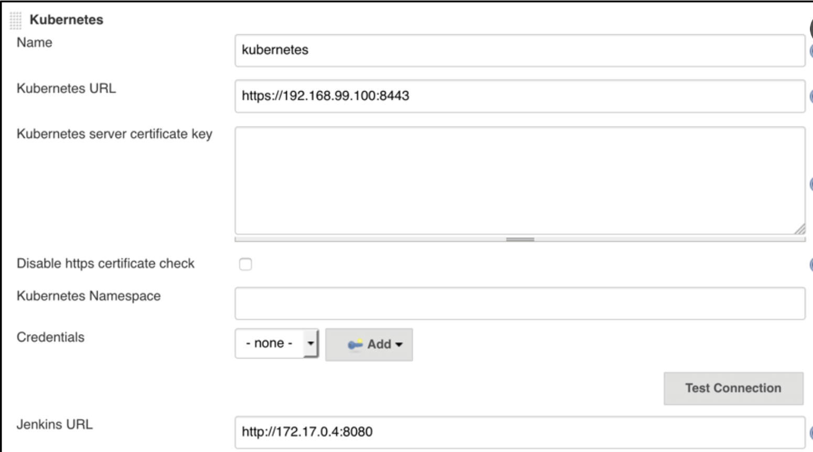
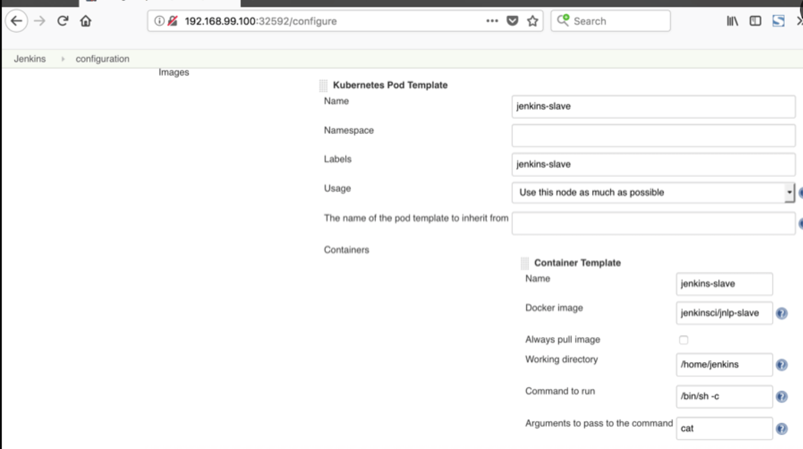

# Jenkins Examples

## Jenkins on Azure - Examples

Jenkins plugins for Azure: https://docs.microsoft.com/en-us/azure/developer/jenkins/plug-ins-for-azure

Installing Jenkins on Azure VM: https://docs.microsoft.com/en-us/azure/developer/jenkins/configure-on-linux-vm

Scale Jenkins with VMs on Azure: https://docs.microsoft.com/en-us/azure/developer/jenkins/scale-deployments-using-vm-agents?tabs=windows

Jenkins build agents as azure container instances: https://docs.microsoft.com/en-us/azure/developer/jenkins/azure-container-instances-as-jenkins-build-agent

Deploy from github to AKS: https://docs.microsoft.com/en-us/azure/developer/jenkins/deploy-from-github-to-aks

Creating a Jenkins pipeline using github and docker: https://docs.microsoft.com/en-us/azure/developer/jenkins/pipeline-with-github-and-docker

Jenkins X on AkS: https://cloudblogs.microsoft.com/opensource/2019/03/06/jenkins-x-azure-kubernetes-service-setup/

More Jenkins info: https://docs.microsoft.com/en-us/azure/developer/jenkins/

## Kubernetes example

Fill in the Kubernetes plugin configuration. In order to do that, you will open the Jenkins UI and navigate to 
**Manage Jenkins -> Configure System -> Cloud -> Kubernetes** and enter in the *Kubernetes URL* and *Jenkins URL*
appropriately, this is unless Jenkins is running in Kubernetes in which case the defaults work.

Supported credentials include:

* Username/password
* Secret File (kubeconfig file)
* Secret text (Token-based authentication) (OpenShift)
* Google Service Account from private key (GKE authentication)
* X.509 Client Certificate

To test this connection is successful you can use the **Test Connection** button to ensure there is
adequate communication from Jenkins to the Kubernetes cluster, as seen below

In addition to that, in the **Kubernetes Pod Template** section, we need to configure the image that will be used to 
spin up the agent pod. We do not recommend overriding the `jnlp` container except under unusual circumstances. 
for your agent, you can use the default Jenkins agent image available in [Docker Hub](https://hub.docker.com). In the 
‘Kubernetes Pod Template’ section you need to specify the following (the rest of the configuration is up to you):
Kubernetes Pod Template Name - can be any and will be shown as a prefix for unique generated agent’ names, which will 
be run automatically during builds
Docker image - the docker image name that will be used as a reference to spin up a new Jenkins agent, as seen below

# Kubernetes Cloud Configuration

In Jenkins settings click on add cloud, select `Kubernetes` and fill the information, like
_Name_, _Kubernetes URL_, _Kubernetes server certificate key_, ...

If _Kubernetes URL_ is not set, the connection options will be autoconfigured from service account or kube config file.

When running the Jenkins controller outside of Kubernetes you will need to set the credential to secret text. The value of the credential will be the token of the service account you created for Jenkins in the cluster the agents will run on.

If you check **WebSocket** then agents will connect over HTTP(S) rather than the Jenkins service TCP port.
This is unnecessary when the Jenkins controller runs in the same Kubernetes cluster,
but can greatly simplify setup when agents are in an external cluster
and the Jenkins controller is not directly accessible (for example, it is behind a reverse proxy).
See [JEP-222](https://jenkins.io/jep/222) for more.

> **Note:** if your Jenkins controller is outside of the cluster and uses a self-signed HTTPS certificate, you will need some [additional configuration](#using-websockets-with-a-jenkins-master-with-self-signed-https-certificate).

### Restricting what jobs can use your configured cloud

Clouds can be configured to only allow certain jobs to use them.

To enable this, in your cloud's advanced configuration check the
`Restrict pipeline support to authorized folders` box. For a job to then
use this cloud configuration you will need to add it in the jobs folder's configuration.